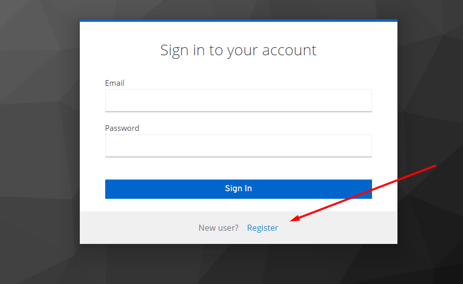

# Challenge Innoscripta

## Prerequisites

Make sure you have the following software installed on your machine:

- [Docker](https://www.docker.com/)
- [Node.js](https://nodejs.org/)
- [npm](https://www.npmjs.com/)
- [Composer](https://getcomposer.org/)

If not, the script run-project.sh will try to install to you.

## Getting Started

Follow the steps below to set up and run the project.

Clone the Repository

```bash
git clone https://github.com/Renato27/innoscripta.git
cd innoscripta
```

Create a database called INNOSCRIPTA or change the Laravel .env for your settings

Run Setup Script

```bash
bash run-project.sh
```

### P.S.

frontend server = http://localhost:3000/

backend server = http://localhost:8002/api

keycloak server = http://localhost:8080

You need to wait few minutes to use the application, as Keycloak takes a while to start.

To register a new user you need to follow the steps below

